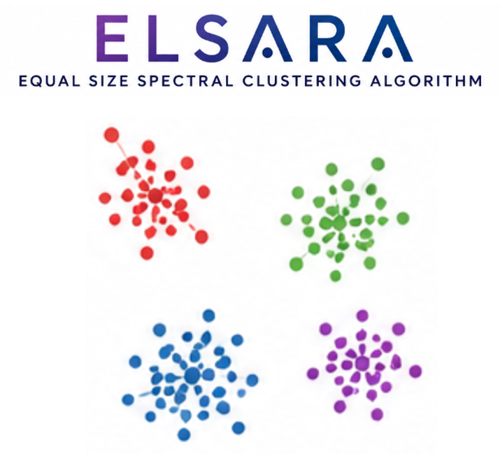

[](LICENSE)

# ELSARA: EquaL-size SpectrAl clusteRing Algorithm
This is a modification of the [spectral clustering algorithm](https://scikit-learn.org/stable/modules/generated/sklearn.cluster.SpectralClustering.html) that builds clusters balanced 
in the number of points. A detailed explanation of the model can be found 
[in this Medium blog post](https://medium.com/data-science/equal-size-spectral-clustering-cce65c6f9ba3).

## Prerequisities
* Python 3.13 
* Poetry (in MAC: `brew install poetry`)

## Setup

Install dependencies and register the git hooks:

```bash
poetry install
make install-hooks
```

## Code formatting

This project uses [ruff](https://docs.astral.sh/ruff/) and [black](https://black.readthedocs.io/) for code formatting. To format all files manually, run:

```bash
make format
```

Formatting also runs automatically on every commit via [pre-commit](https://pre-commit.com/).

## Toy datasets
In the folder `datasets` we have provided you with a toy dataset
so you can run the clustering code right away. 

* *restaurants_in_amsterdam.csv:* A table with locations of restaurants in the city of Amsterdam
*  *symmetric_distr_tr.npy:* A file with the travel distance between the restaurants

You can find more specification on how to use these datasets in the project's [blog post](https://medium.com/data-science/equal-size-spectral-clustering-cce65c6f9ba3). 

## Examples
* *example1.py:* From a set of hyperparameters, you obtain clusters with sizes roughly equal to N / `nclusters`  
* *example2.py:* From a range of cluster sizes, you obtain the clusters hyperparameters to run the clustering code. 

## License
This project is licensed under the [MIT License](LICENSE).
